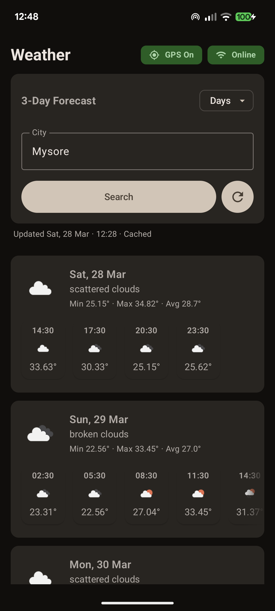
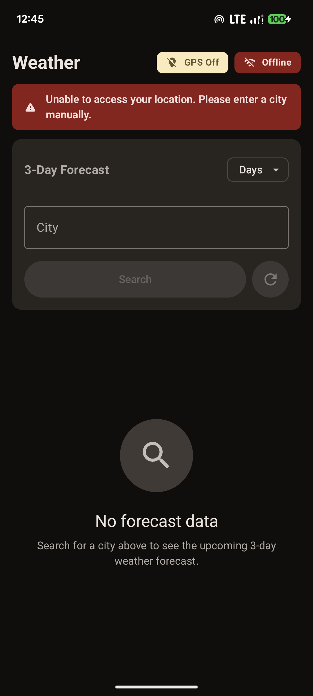
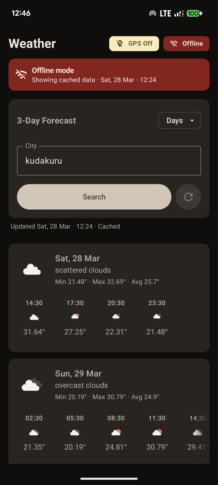
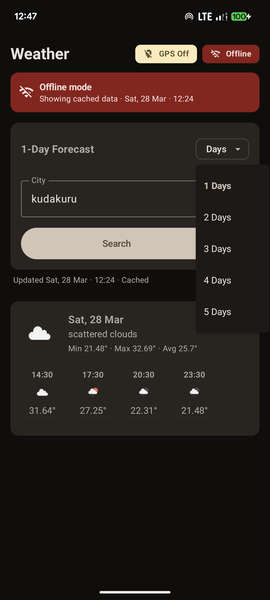
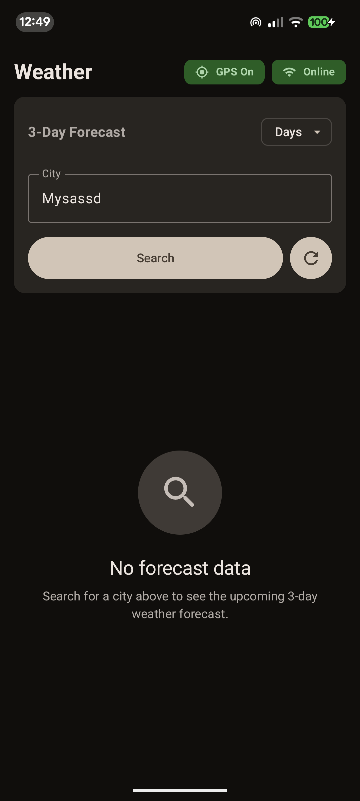

# WeatherApp

Android weather app built with Kotlin + Jetpack Compose. It fetches a city forecast, caches it locally, and renders a 3-day grouped view with hourly slots.

## What This App Does

- Search weather by city name.
- Show loading, error, and success states.
- Keep and reuse cache when it is fresh.
- Refresh from network when cache is stale or user forces refresh.
- Show network connectivity state (`online`/`offline`).
- Supports forecast data only within the API-provided range (today + next 4 days).

## Architecture at a Glance

- `ui/` -> Compose screens (`ForecastRoute`, `ForecastScreen`, components)
- `ui/presentation/viewmodel/ForecastViewModel.kt` -> UI state + event handling
- `domain/usecase/GetForecastUseCase.kt` -> cache-vs-network decision logic
- `data/repository/ForecastRepositoryImpl.kt` -> API + Room persistence
- `data/common/NetworkMonitor.kt` -> connectivity flow

Flow style: **UI -> ViewModel -> UseCase -> Repository -> (Room / OpenWeather API) -> ViewModel -> UI**

## End-to-End Flow

1. App starts at `MainActivity`, which hosts `ForecastRoute`.
2. `ForecastRoute` collects `ForecastState` and triggers initial `Search` when no items exist.
3. User actions dispatch `ForecastEvent`:
   - `CityChanged`
   - `Search`
   - `Retry`
   - `Refresh`
4. `ForecastViewModel` handles events and calls `fetch(force = ...)`.
5. `fetch()` launches with `launchWithPrevious(...)` to coordinate with any previous request job.
6. `GetForecastUseCase` emits `Resource.Loading` first, then decides:
   - Use cache if valid/fresh.
   - Else geocode city -> fetch remote forecast -> cache -> emit success.
   - Emit error if geocode/fetch fails.
7. On success, `ForecastViewModel.aggregateThreeDays(...)` groups raw entries into 3 daily cards with hourly chips.
8. UI re-renders from state updates (`isLoading`, `error`, `items`, `isFromCache`, `lastUpdated`, `isOnline`).

## Use Cases Covered

### 1) Search Forecast by City

- **Input:** city text + `Search` event.
- **Result:** loading -> forecast cards or error.

### 2) Initial Auto Search

- On first composition, if list is empty, app triggers `Search` automatically.

### 3) Retry / Refresh

- `Retry` and `Refresh` both call `fetch(force = state.isOnline)`.
- If online, previous work can be canceled and a fresh request is started.
- If offline, app avoids forced network refresh and follows normal cache path.

### 4) Fresh Cache Reuse

- Use case reuses cache only when all are true:
  - not forced,
  - cache is not empty,
  - `lastFetched` exists and is from today,
  - cache has at least one entry for today,
  - age is within dynamic freshness window.

### 5) Dynamic Freshness Window

- If today has full 3-hour slot coverage (>= 8), cache may be accepted up to 24h.
- Otherwise a shorter 3h window is used.

### 6) Offline-Aware UX

- `NetworkMonitor` emits validated internet state.
- `ForecastState.isOnline` updates continuously.
- UI can show offline banner/badge while still serving cache.

### 7) Three-Day Aggregation for Presentation

- Raw forecast entries are filtered to forecast window dates.
- Data is grouped by local date.
- For each day: min/max/avg temperature + primary condition + hourly slots.
- Limited to 3 days for compact UI.

## Resource State Contract

`Resource<T>` is the ViewModel/use-case contract:

- `Loading` -> show progress
- `Success(data, fromCache, lastUpdatedMillis)` -> show content and metadata
- `Error(message)` -> show failure UI

## Data Sources

- **Remote:** OpenWeather API (`WeatherApi` via Ktor)
- **Local:** Room (`CityEntity`, `ForecastEntity`)
- **Repository behavior:** network results are persisted, cache is window-filtered on reads
- **API limitation:** manual past-date selection or far-future date selection is not supported by the backend forecast API.

## Configuration

App expects OpenWeather values from either `local.properties` or environment variables:

- `openWeatherApiKey` or `OPENWEATHER_API_KEY`
- `openWeatherBaseUrl` or `OPENWEATHER_BASE_URL` (defaults to `https://api.openweathermap.org/`)

Example (`local.properties`):

```properties
openWeatherApiKey=YOUR_KEY_HERE
openWeatherBaseUrl=https://api.openweathermap.org/
```

## Demo & Screenshots

### App Screenshots

| Online with GPS | Offline No GPS | Offline with Cache |
|---|---|---|
|  |  |  |

| Configure Days | No Forecast Data |
|---|---|
|  |  |

**Key UI Features:**
- `GPS On`/`GPS Off` badge with settings link (tap to open app permissions)
- `Online`/`Offline` connectivity badge with smart caching
- Configurable forecast days (1-5 days)
- Real-time weather data with hourly slots
- Last updated timestamp + cache indicator
- Graceful error handling when no data available

### Video Demo

Watch the app in action:

[](https://drive.google.com/file/d/1rsD01JblelD1JJqhJyRNSqCKX2zXlahr/view?usp=drive_link)

**Direct Link:** [Full App Demo Video](https://drive.google.com/file/d/1rsD01JblelD1JJqhJyRNSqCKX2zXlahr/view?usp=drive_link)

## Downloads

### Latest APK Release

| Platform | Link | Version |
|---|---|---|
| **Direct APK Download** | [weatherapp-release.apk](https://drive.google.com/file/d/1bGaw-zuAYnHMCxK4Kz14DQY8g3EIyWra/view?usp=drive_link) | v1.0 |
| **GitHub Repository** | [View Source](https://github.com/Maheshkkumarkr/ForecastWeather) | Latest |

**Installation Instructions:**

Option 1: Direct from Drive
```
1. Click the APK link above
2. Download the file
3. Transfer to your Android device
4. Open file manager → tap APK → Install
```

Option 2: Via ADB (Android Debug Bridge)
```bash
# Connect device via USB with debugging enabled
adb install weatherapp-release.apk
```

Option 3: Android Studio
```
1. Open Android Studio
2. Run → Select Deployment Target (your device)
3. Click Run or .\gradlew.bat :app:installDebug
```

**Minimum Requirements:**
- Android 7.0 (API 24)
- Location Permission (optional, for GPS-based weather)
- Internet Connection (recommended for live data)

## Build and Run

```powershell
.\gradlew.bat :app:assembleDebug
```

Install/run from Android Studio or deploy generated APK to a device/emulator.

## Notes

- Date filtering and grouping are device-local-date aware (`ForecastDateUtils`).
- Cache can be cleaned/trimmed when stale entries fall outside the forecast window.
- The app currently focuses on a single-screen forecast workflow.
- OpenWeather forecast endpoint returns 5 days total (`today + 4 future days`, in 3-hour slots); dates outside this range are not available even if changed manually.

